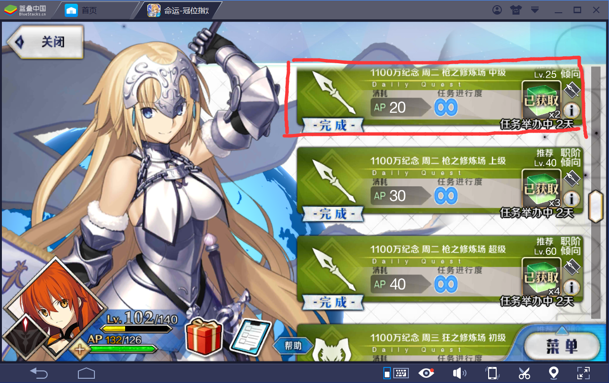

# FGO刷材料脚本

## 贪玩要求:

- 平台: Win 7+

- 安装[蓝叠模拟器](https://www.bluestacks.com/), 将模拟器的分辨率调整为1280 * 720, 并将模拟器左上角对准PC屏幕左上角. 若窗口被resize, 请点击右上角【设置】里的【重置分辨率】选项.

- Python库依赖:

   - `win32api win32con win32gui`:

      Miniconda/Anaconda预装, 或者你可以从 https://www.lfd.uci.edu/~gohlke/pythonlibs/ 下载.

   - `numpy, scipy`:

      Anaconda预装, Windows通过`conda install`命令可以安装.

      注: 在没有visual studio c++ build tools的情况下, 从PyPI源中安装`scipy`或`numpy`会失败.

   - `PyQt5`:
      Anacodna预装.可以通过`pip install`安装.

   - `wisepy`等

      这些依赖最终会被消除.它们是我平时快速实现prototype使用的个人package, 功能强大但实现evil.

      `wisepy`是一个python命令行框架,用来代替每次都需要查文档的`argparse`.

   - [Pytorch](https://pytorch.org/):

      **安装它, 几乎是在使用该项目时, 唯一耗时的步骤**.

- 推荐的依赖安装步骤

   **建议使用anaconda发行版**, 目前虽然[中国已经没有了conda镜像](https://mirrors.ustc.edu.cn/help/anaconda.html), 但目前官方源的下载速度变得非常快. Anaconda/Miniconda下载位置见 https://www.anaconda.com/distribution/ .

   对于anaconda用户, Python依赖的安装方法:

   ```
   pip install wisepy generic_classifier

   #无Nvidia显卡用户: conda install pytorch-cpu torchvision-cpu -c pytorch
   conda install pytorch torchvision cudatoolkit=9.0 -c pytorch
   ```

   对于miniconda用户, 你需要**增加额外步骤**:

   ```
   conda install numpy scipy PyQt5
   ```

   对于pip用户, 你需要**增加额外步骤**:

   - `pip install PyQt5`
   - 从 https://www.lfd.uci.edu/~gohlke/pythonlibs/ 下载 `win32api win32con win32gui scipy numpy`并用pip安装.


## 使用方法


### 模型训练

没有Nvidia显卡的用户暂时无法训练自己的模型, 但可以使用别人训练好的模型.

训练模型需要不同状态下的图片数据, 数据目前放置于`根目录/fgo/fgo_data`中.

目前使用了级联分类器, 很好的解决了实时预测的可靠性问题, 以及训练数据量的问题.

在`fgo_data`目录里, 任意(递归的)一个文件夹下面如果包含多个名为`cls_xxx`的文件夹, 表示将会训练一个级联分类其. 例如, 下列文件结构中

```
fgo_data/
   - cls_a/
      - cls_x/
         - *.jpg
         - *.png
      - cls_y/
         - *.jpg
         - *.png
   - cls_b/
      - *.jpg
      - *.png
```

执行自动化程序, 将会持久化2个模型, `fgo_data/mml`, `fgo_data/cls_a/a`,

```
fgo_data/
   - cls_a/
      - cls_x/
         - *.jpg
         - *.png
      - cls_y/
         - *.jpg
         - *.png
      - a # 模型
   - cls_b/
      - *.jpg
      - *.png
   - mml # 根模型
```

对图像数据的预测结果的取值为`a.x, a.y, b`.

训练不需要专门步骤, 只要按照下列结构在`根目录/fgo/fgo_data`中提供数据即可. 下列涉及到的类别的具体含义, 可以查看项目在对应文件夹下提供的示例图片.

```
fgo_data/
   - cls_battle/
      - cls_perform/
         - cls_select/
         - cls_all/
      - cls_wait/
   - cls_not_battle/
   - cls_battle_ending/
   - cls_release/
   - cls_exhausted/
```

模型将会自动被训练和持久化.

### 应用

- FGO: 在模拟器中下载并打开游戏, 路线【迦勒底之门】->【每日任务】, 选择一个要刷的图, 放置在下图的红线框内:



最后在管理员模式(建议powershell, cmder会蜜汁出错)下, 运行根目录`auto_fgo.py`即可.

如果想要随机刷图, 参考源代码`fgo/管理室.py`.

**注意**: **脚本不刷图失败的情况**.

**注意**: **体力耗尽后**, 会自动使用**体力恢复选项中的第二个物品**, 通常来说是**金苹果**.


**注意, 关于训练模型的问题**:

模型在不同分辨率的屏幕上似乎无法通用, 建议自行训练.

如果你觉得脚本效果不好, 可以删除`fgo/fgo_data`下的所有模型文件, 并修改用以训练的数据文件夹, 并重新运行脚本`auto_fgo.py`. 新的模型会被自动训练.
